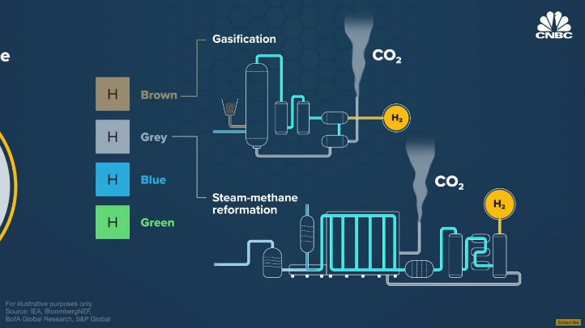
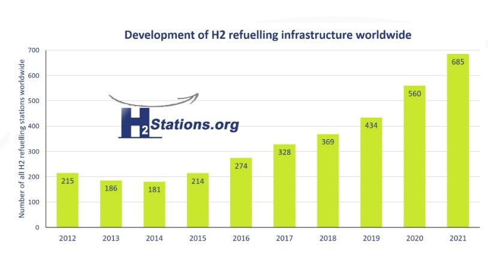
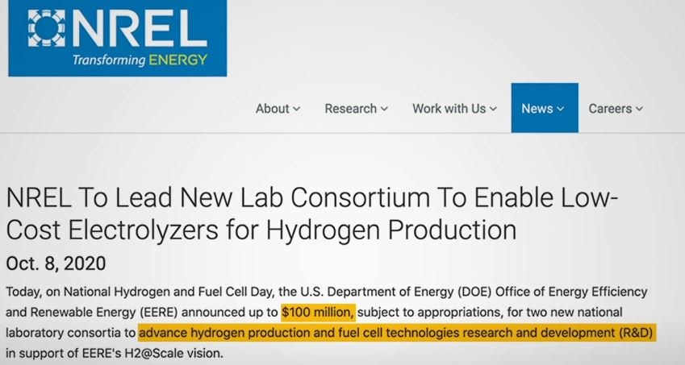
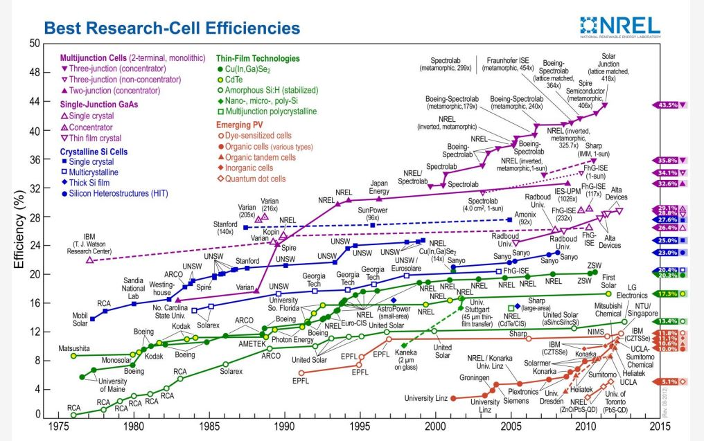
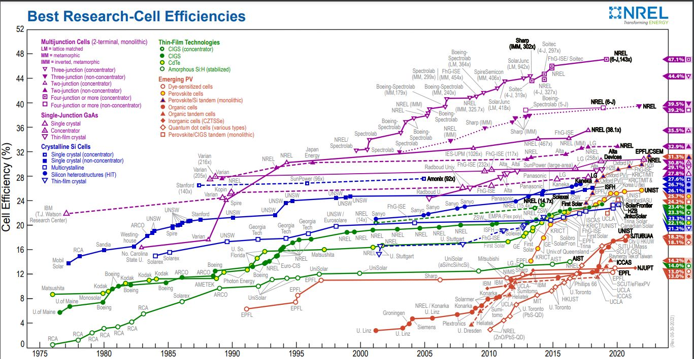
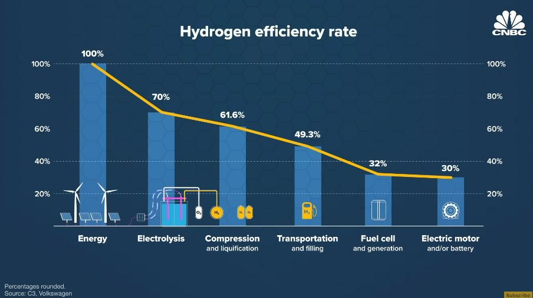
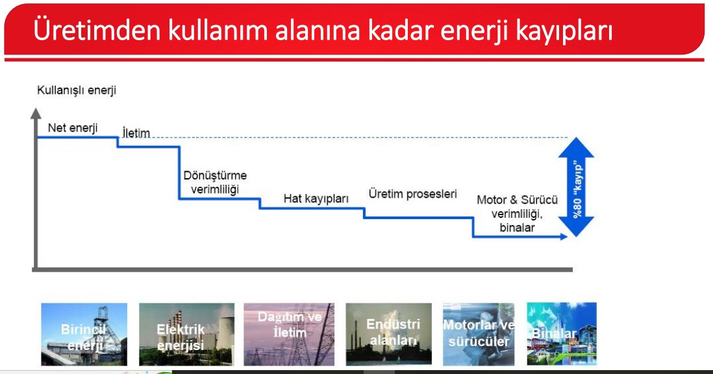
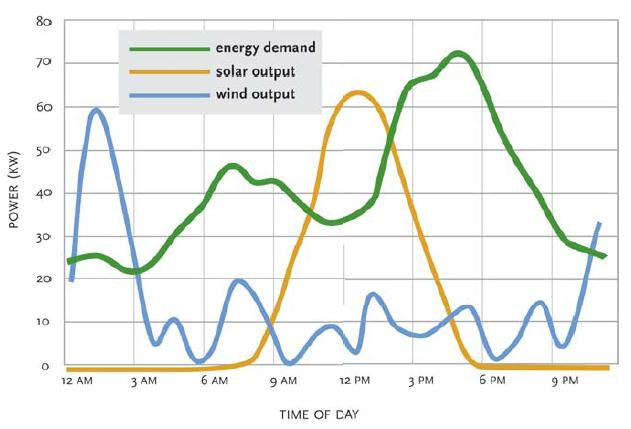

# Hidrojen ve Enerji Depolama

Hidrojen bölümü staj defterinde biraz dağınık ilerliyordu. Üretim biçimleri, renk sınıflandırmaları, ülkelerin yatırım haberleri, hidrojenli arabalar, batarya karşılaştırması, verimlilik itirazı ve depolama meselesi aynı dosyanın içinde yan yana duruyordu.

Burada onları daha tek akışlı kurmaya çalışıyorum. Çünkü benim için hidrojen meselesinin ilginç tarafı "iyi mi kötü mü?" sorusu değil. Daha çok şu:

> Hidrojeni hangi sistem sınırı içinde değerlendiriyoruz?

Eğer sadece son kullanımda su açığa çıkaran temiz bir molekül diye bakarsak bir tarafını görüyoruz. Eğer sadece "her aşamada kayıp var" diye bakarsak başka bir tarafını görüyoruz. Bence ikisi de tek başına yetmiyor.

## Hidrojen Temiz Yanıyor, Ama Temiz Elde Edilmiyor Olabilir

Hidrojen çok reaktif olduğu için doğada tek başına bulunmuyor; su gibi başka bileşiklerin içinde bulunuyor. Bu yüzden hidrojeni kullanmak istiyorsak önce onu elde etmemiz gerekiyor. Bu da enerji harcamak demek.

Defterde beni ilk düşündüren nokta buydu: Hidrojen temiz yanan bir molekül olabilir, ama onu üretme biçimimiz temiz değilse toplam sistem temiz olmayabilir.

Bu yüzden hidrojenin rengi sadece isimlendirme gibi görünse de aslında üretim yolunu ve karbon etkisini anlatıyor. Yalnız burada küçük bir not gerekiyor: Bu renk adları pratik bir kısa yol; her kaynakta aynı kesinlikte tanımlanan teknik standartlar gibi düşünmemek lazım.

| Tür | Kısa açıklama |
|---|---|
| Kahverengi hidrojen | Genellikle kömürün gazlaştırılmasıyla üretilir. |
| Gri hidrojen | Genellikle doğalgaz gibi fosil kaynaklardan üretilir. |
| Mavi hidrojen | Fosil kaynaklardan üretilir; çıkan CO2'nin tutulup saklanması hedeflenir. |
| Yeşil hidrojen | Yenilenebilir elektrikle elektroliz yapılarak sudan üretilir. |

*Şekil 1. Hidrojen renkleri burada uzun bir tanım listesi olsun diye durmuyor. "Temiz hidrojen" dediğimiz şeyin üretim yoluna bağlı olduğunu hızlıca hatırlatıyor. Kaynak durumu kısmen net.*

Kahverengi ve gri hidrojen için defterde kurduğum benzetme hala işe yarıyor gibi geliyor: Çevrecilik açısından bu durum, dizel jeneratörle şarj edilen elektrikli arabaya benziyor sanki. Bu benzetmeyi stajdaki bir anlatımdan esinlenerek kurmuştum. Son kullanıcı tarafında elektrikli araba temiz görünebilir; ama elektriği nasıl ürettiğimiz sorusunu dışarıda bırakırsak resmi eksik okuruz.

Hidrojen için de benzer bir şey var. Son kullanımda su çıkıyor diye hikaye bitmiyor. Hidrojen nereden geldi? Hangi enerjiyle üretildi? Üretim sırasında karbon salındı mı? Bu sorular olmadan "temiz" kelimesi biraz hızlı söylenmiş oluyor.

## Hidrojen Enerji Kaynağı mı, Taşıyıcı mı?

Hidrojenle ilgili önemli ayrımlardan biri şu: Hidrojen çoğu kullanımda doğrudan bir enerji kaynağı değil, enerji taşıyıcısı gibi düşünülmeli.

Örneğin hidrojenli bir araçta hidrojen depoya konuyor. Sonra yakıt hücresi hidrojeni ve oksijeni kullanarak elektrik üretiyor. Bu elektrik motoru döndürüyor. Yani hidrojen, elektriği başka bir forma çevirip taşımaya yarayan bir ara halka gibi çalışıyor.

Burada batarya ile fark ortaya çıkıyor. Batarya elektriği doğrudan depoluyor. Hidrojen ise önce elektrikle üretilebiliyor, sonra sıkıştırılıyor veya taşınıyor, sonra tekrar elektriğe çevriliyor. Bu yüzden hidrojenli araçlarda dolum süresi, menzil veya ağırlık açısından bazı avantajlar konuşulabiliyor; ama bu avantajlar dönüşüm zincirindeki kayıplarla birlikte tartılmalı.

Benim için mesele "batarya mı hidrojen mi?" diye tek cevaplı bir yarış değil. Kullanım bağlamı önemli:

- Kısa mesafe ve sık şarj edilebilen kullanımda batarya daha mantıklı olabilir.
- Ağırlık, hacim, uzun mesafe veya uzun süreli depolama önemliyse hidrojenin başka bir rolü olabilir.
- Sanayi gibi doğrudan elektrifikasyonu zor alanlarda hidrojen daha ciddi bir aday haline gelebilir.

Yani soru benim için şuna dönüyor: Hangi enerji formu, hangi iş için, hangi kayıplarla ve hangi altyapıyla daha anlamlı?

## Hidrojenli Araçlar: Menzil, Dolum ve Altyapı Sorusu

Defterde hidrojenli araç kısmı biraz daha somuttu. Hidrojenin kendisi doğrudan enerji kaynağı gibi değil; araçta yakıt hücresi, hidrojeni oksijenle birlikte kullanıp elektrik akımına çeviriyor. Bu akım da elektrik motorunu döndürüyor. Son ürün tarafında su açığa çıkıyor. Bu anlatı kulağa temiz ve düzenli geliyor; ama hemen ardından zincirin bütün kayıpları ve altyapısı geliyor.

Notebook'ta hidrojenli araç için dolum süresinin kısa olabileceği, bataryalı araçta şarj süresinin daha uzun olduğu; aynı hacim için hidrojen deposunun daha fazla enerji taşıyabileceği gibi notlar vardı. Bunları burada kesin otomobil karşılaştırması gibi büyütmek istemiyorum. Çünkü araç modeli, tank basıncı, batarya kimyası, dolum istasyonu, güvenlik ve maliyet gibi çok fazla değişken var. Ama notebook'taki düşünce açısından önemli olan şu: Hidrojen bazı yerlerde verimden kaybedebilirken, hacim/ağırlık, dolum süresi ve uzun mesafe gibi başka başlıklarda yeniden tartışmaya girebiliyor.

*Şekil — Notebook'ta hidrojenli araçları konuşurken kullandığım altyapı grafiği. Kaynak durumu kısmen net; bu yüzden kesin pazar verisi gibi değil, "teknoloji yalnız araçtan ibaret değil, istasyon ağı da gerekiyor" fikrini görünür kılmak için kullanıyorum.*

Bu bölüm beni kısa bir yan soruya da götürmüştü: Eğer amaç küçük hacim ve az yakıtla çok uzun mesafe gitmekse, nükleer yakıtlı araçlar neden gündelik ulaşımda yok? Nükleer denizaltı/uçak gemisi örneklerinden yola çıkarak mikroreaktörleri araştırmıştım. Sonra da bunun sivil kullanımda neden çok sınırlı kalacağını düşünmüştüm: güvenlik, kontrol, tersine mühendislik ve kötüye kullanım riski. Bu kısım hidrojen yazısının ana gövdesi değil; ama defterde hidrojenin "enerji yoğunluğu" iddiasını sorgularken aklımın nasıl başka ihtimallere de sıçradığını gösteriyor.

## Kullanım Alanları: Araçtan Önce Sanayiye Bakmak

Staj defterinde hidrojenin kullanım alanları olarak petrol arıtma, amonyak üretimi, metanol üretimi ve çelik üretimi not edilmişti. Bu liste önemli; çünkü hidrojeni sadece otomobil yakıtı gibi düşünmek resmi daraltıyor.

Hidrojenin bana daha ilginç gelen tarafı, bazı sektörlerde karbon salımını azaltmak için seçeneklerden biri olması. Özellikle çelik gibi yüksek sıcaklık ve kimyasal süreç isteyen alanlarda sadece yenilenebilir elektrik üretmek yetmeyebilir. Defterde de şu fikir vardı: Sadece yenilenebilir enerjiyle toplam karbon salımını azaltmak mümkün olsa bile, birçok sanayi kuruluşu çalışırken karbon salmaya devam edecek.

Bu iddiayı çok büyük ve kesin bir hüküm gibi yazmak istemiyorum. Çünkü hangi sektör için hangi çözümün daha iyi olduğu ayrı ayrı tartışılmalı. Ama hidrojenin konuşulmasının bir nedeni burada: Her şeyi batarya veya doğrudan elektrikle çözmek kolay değil.

## Ülke Teşvikleri ve NREL: Teknoloji Eğrisini Unutmamak

Notebook'ta hidrojenin kullanım alanlarından sonra bir de teşvikler ve kurumlar kısmı vardı. AB'nin Yeşil Anlaşması, Çin, Güney Kore, Japonya ve ABD'nin hidrojen/temiz enerji yatırım açıklamaları gibi notlar almıştım. Bunları bugün tek tek politika analizi gibi yazmak istemem. Ama tamamen atınca da hidrojenin neden bir anda bu kadar konuşulduğu sorusu eksik kalıyor.

*Şekil — Notebook'taki haber ekran görüntüsü. Görseli haberin tamamını kanıtlamak için değil, hidrojen tartışmasının yalnız teknik değil, politika ve yatırım ölçeğiyle de beslendiğini göstermek için kullanıyorum.*

ABD tarafında NREL'in hidrojen üretimi ve yakıt hücreleri için bir laboratuvar konsorsiyumuna öncülük edeceğine dair haberini not etmiştim. Bu haberi ilginç bulmamın sebebi sadece 100 milyon dolar ifadesi değildi. NREL adını daha önce güneş hücrelerinin verimlilik çizelgelerinde görmüştüm. Yani aynı kurum, bir teknolojinin yıllar içinde nasıl geliştiğini izlemek için bende zaten bir referans noktasıydı.

*Şekil — Bu ekran görüntüsü, hidrojenin yalnız bugünkü maliyet/verim tartışmasıyla değil, Ar-Ge ve öğrenme eğrisiyle de birlikte düşünülmesi gerektiğini hatırlatıyor.*

Defterde bu yüzden iki NREL güneş hücresi verimlilik çizelgesini yan yana düşünmüştüm. Biri 2014 ders notundan, diğeri 2022'de indirdiğim güncel çizelgedendi. Güneş hücrelerinin farklı türlerinde verimliliklerin artması, yeni hücre türlerinin eklenmesi ve araştırma yapan kurum sayısının çoğalması bende şu fikri doğurmuştu: Bir teknolojinin bugünkü verimi düşük diye, gelecekteki potansiyelini tamamen kapatmak doğru olmayabilir.

*Şekil — Notebook'ta hidrojen Ar-Ge haberini okurken aklıma gelen eski NREL çizelgesi. Hidrojenin kendisini değil, teknoloji eğrisi fikrini taşımak için burada.*

*Şekil — Güncel çizelgeyle birlikte bakınca, teknolojilerin sabit kalmadığını daha görünür kılıyor. Bu, hidrojen eleştirisini geçersiz kılmıyor; sadece bugünkü maliyet/verim bilgisini tarihsel bir teknoloji eğrisiyle birlikte okumaya zorluyor.*

## "Her Aşamada Kayıp Var" İtirazı

Hidrojenin en güçlü eleştirilerinden biri verimlilik meselesi. Kabaca şöyle deniyor: Elektriği kullanıp hidrojen üretiyoruz, sonra hidrojeni sıkıştırıyoruz veya taşıyoruz, sonra yakıt hücresinde tekrar elektriğe çeviriyoruz, sonra motoru döndürüyoruz. Her aşamada kayıp var.

Bu eleştiri önemli. Hatta ilk bakışta oldukça ikna edici.

*Şekil 2. Bu görsel hidrojen zincirindeki dönüşüm kayıplarını gösteriyor. Tek başına "hidrojen kötüdür" demek için değil, itirazın nereden geldiğini görmek için kullanıyorum.*

Defterde bu noktada şunu yazmıştım: Çok emin olmadan, bu anlatılana iki açıdan itiraz edeceğim.

Bu cümleyi özellikle korumak istiyorum. Çünkü burada amacım hidrojen savunuculuğu yapmak değildi. Sadece eleştirinin sistem sınırını sorgulamaktı.

## Birinci İtiraz: Kayıp Var, Ama Neye Göre?

Birinci soru şu: Diğer enerji kaynaklarında kayıplar daha mı az?

Hidrojen için "yenilenebilir elektrikten tekerleğe kadar çok yüksek kayıp var" gibi bir zincir kurulabiliyor. Bu ciddi bir itiraz. Ama bu kaybı tek başına görmek yetmeyebilir. Diğer enerji üretim ve kullanım zincirlerinde de kayıplar var. Kaynaktan son kullanıcıya kadar olan yolda ne kadar enerji yararlı işe dönüşüyor?

Enerji Bakanlığı raporuyla ilişkilendirdiğim bir grafikte, hidrojen dışındaki bazı enerji yollarında da üretimden kullanıma kadar ciddi kayıplar olduğu görülüyordu. Defterde bu yüzden şu ihtimali yazmıştım: Tek bir zincire bakıp hemen hüküm vermek yanıltıcı olabilir.

*Şekil 3. Bu görsel hidrojen eleştirisini başka enerji zincirleriyle yan yana düşünmek için var. Tek bir dönüşüm zincirini alıp oradan hemen hüküm vermemek gerekiyor.*

Buradan "o zaman hidrojen verimli" sonucu çıkmıyor. Sadece daha dikkatli bir soru çıkıyor: Hangi zincirin hangi noktasını kıyaslıyoruz?

Eğer bataryalı araçla hidrojenli aracı aynı elektrik kaynağı üzerinden, aynı mesafe ve aynı kullanım için kıyaslıyorsak batarya çok daha iyi çıkabilir. Ama mevsimsel depolama, sanayi kullanımı veya uzak taşıma gibi başka bir kullanım düşünüyorsak tablo değişebilir. Verimlilik sayısı aynı kalır, ama karar değişebilir.

## İkinci İtiraz: Verim Düşükse Bile Kaynak ve Zaman Önemli Olabilir

İkinci itirazım biraz daha temkinliydi. Diyelim ki hidrojen zinciri gerçekten düşük verimli. Bu tek başına her zaman yeterli karar ölçütü mü?

Eğer kullanılan kaynak bol, ucuz, başka türlü değerlendirilemeyen veya belirli saatlerde ihtiyaç fazlası olarak ortaya çıkan yenilenebilir elektrikse, düşük verim her durumda aynı anlama gelmeyebilir. Elbette kayıp yine kayıptır. Ama soru şu hale gelir:

> Kaybettiğimiz enerji ne zaman, nerede ve hangi alternatiflere göre kayıp?

Örneğin rüzgar veya güneş üretiminin talebi aştığı saatlerde üretilen fazla elektriği düşünelim. O elektriği hiç kullanamamak da bir kayıp. Eğer bu fazla elektrik uzun süreli depolanamıyorsa, bir kısmını hidrojene çevirmek düşük verimli olsa bile sistem açısından anlamlı olabilir.

Burada savunmak istediğim şey "verim önemli değil" değil. Tam tersi, verimi ciddiye alıyorum. Ama verimi yalnız cihaz verimi gibi değil, sistemin tamamı içinde okumaya çalışıyorum.

## Depolama Sorusu: Peki Nereye Nasıl Depolayabiliriz?

Hidrojenin bana daha anlamlı gelen tarafı araç yakıtı olmasından çok, depolama ihtimaliydi.

Enerji ihtiyacımızı sadece yenilenebilir kaynaklardan elde etmek istiyorsak, mutlaka depolama meselesiyle yüzleşmemiz gerekiyor. Peki neden?

Çünkü güneş ve rüzgar üretimi talep ile aynı anda ve aynı miktarda gelmiyor. Bazı saatlerde üretim fazla olabilir; bazı saatlerde talebi karşılamak zorlaşabilir. Defterde kullandığım grafik bunu görsel olarak anlatıyordu.

*Şekil 4. Bu görsel benim için şu soruyu açıyor: Talep ile üretim aynı saatlerde örtüşmüyorsa, fazla enerjiyi ne yapacağız? Hidrojen burada araç yakıtından çok depolama başlığına bağlanıyor.*

Bataryalar burada güçlü bir çözüm olabilir. Ama staj defterinde de not ettiğim gibi, uzun süreli depolama için bataryaların maliyet ve ölçek açısından her yerde yeterli olmayabileceği söyleniyordu. Defterde grafiğe bakarken daha sert bir ifade kurmuştum: kurulu gücü çok büyütsek bile bazı saatlerde talebi karşılayamıyorsak, yalnız üretim kapasitesini artırmak yetmeyebilir; depolama da sistemin ön koşullarından biri haline gelir.

O zaman "hidrojen nerede işe yarar?" sorusu daha dar ve daha ciddi bir hale geliyor:

- Saatlik depolama mı konuşuyoruz?
- Günlük dalgalanma mı?
- Haftalık veya mevsimsel depolama mı?
- Sanayi için hammadde/enerji taşıyıcısı mı?
- Ulaşımda ağırlık ve menzil problemi mi?

Bu soruların cevabı değiştikçe hidrojenin anlamı da değişiyor.

## NREL Görsellerini Neden Sınırlı Merkezde Tuttum?

Defterde NREL çizelgelerine de yer vermiştim. Daha önce güneş enerjisiyle ilgili bir derste NREL grafiklerini görmüştüm; sonra hidrojen ve yakıt hücreleriyle ilgili yatırımlar bağlamında tekrar karşıma çıkınca ilgimi çekmişti.

NREL çizelgelerinin bende uyandırdığı şey şuydu: Bir teknolojinin bugünkü verimi veya maliyeti, onun gelecekteki potansiyelini anlamak için tek başına yeterli olmayabilir. Güneş hücrelerinde yıllar içinde farklı teknolojilerin verimliliklerinin arttığını görmek, hidrojen elektrolizörleri veya yakıt hücreleri için de "bugünkü sınırlara bakarken teknoloji eğrisini tamamen unutmayalım" dedirtiyor.

Bu yazıda NREL görsellerini eskisinden daha görünür tuttum ama yine de yazının tek merkezi yapmadım. Çünkü o zaman yazı hidrojenin sistem sınırı ve depolama tartışmasından çıkıp, teknoloji haberleri ve grafik derlemesine dönüşebilirdi. NREL kısmının işlevi burada daha sınırlı: teknolojilerin zamanla değişebileceğini hatırlatmak.

Yani bugünkü düşük verim veya yüksek maliyet eleştirisini yok saymıyorum. Sadece "bugünkü hali sonsuza kadar aynı kalacak" diye de düşünmemek gerekiyor.

## Slogan Değil, Bedelini de Sormak

Hidrojen hakkında kolay iki cümle kurulabilir:

"Hidrojen geleceğin temiz yakıtıdır."

Ya da:

"Hidrojen verimsizdir, o yüzden anlamsızdır."

Bence ikisi de fazla hızlı.

Hidrojen temiz yanabilir, ama nasıl üretildiği önemli. Enerji taşıyıcısı olabilir, ama her dönüşümde kayıp yaratır. Bataryaya göre bazı kullanım alanlarında zayıf kalabilir, ama uzun süreli depolama veya sanayi gibi alanlarda yeniden düşünülmesi gerekebilir. Verimlilik eleştirisi güçlüdür; yine de hangi sistem sınırı içinde konuştuğumuzu bilmeden tek başına yeterli olmayabilir.

Bu yüzden hidrojen bölümünden bana kalan şey, hidrojeni sevmek veya sevmemek değil. Daha çok, teknolojiye sloganla bakınca bir yerlerin eksik kaldığını fark etmek.

Bir teknolojiye gerçekten bakmak istiyorsak, sadece son ürününe değil; üretim yoluna, taşıma biçimine, kayıplarına, depolama ihtiyacına, maliyetine ve hangi problemi çözmeye çalıştığına birlikte bakmak gerekiyor.

Bana göre hidrojen meselesi biraz burada ilginçleşiyor. Tek cümlelik hüküm vermeyi zorlaştırıyor. Sürekli şu soruyu sorduruyor:

> Neye göre, hangi kullanımda, hangi alternatifle kıyaslıyoruz?
