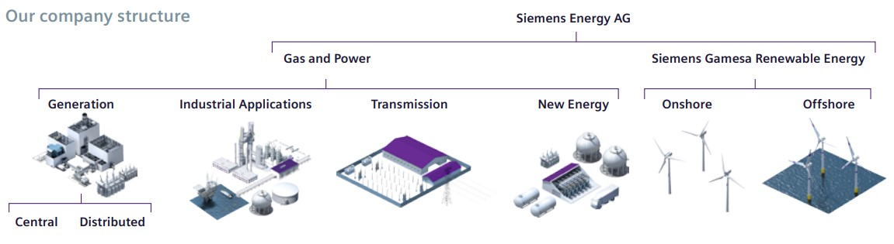
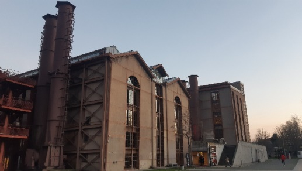
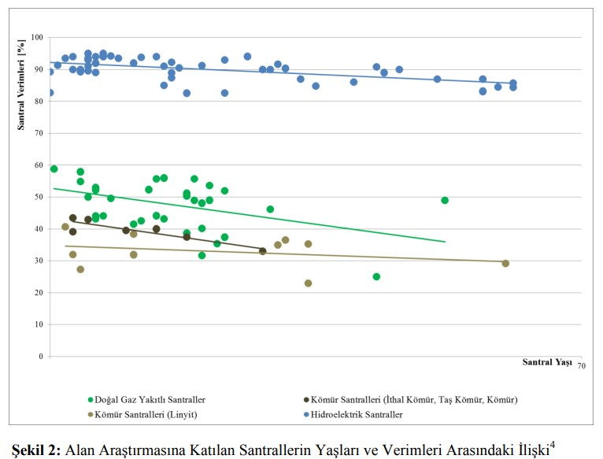
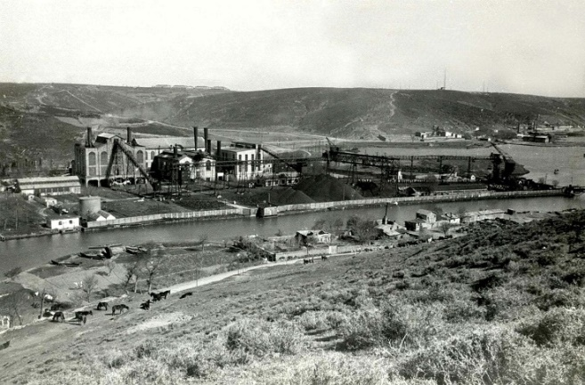
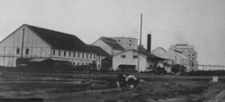
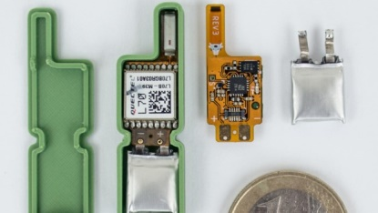
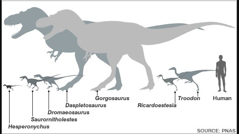
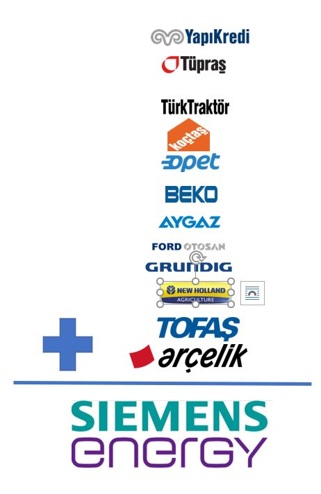
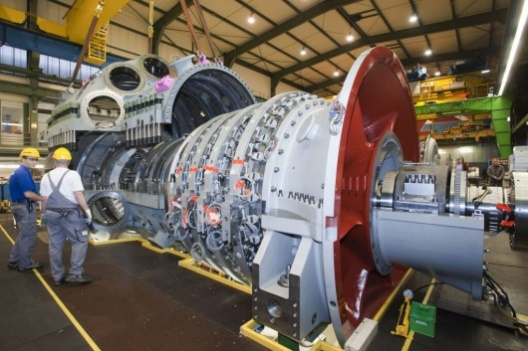

# Tarih, Ölçek ve Bakım

Bu yazı Siemens Energy'nin şirket tanıtımı değil. Staj defterindeki bazı tarihsel ve teknik notları yeniden okuyunca, benim için daha ilginç olan şey şirketin kaç ülkede olduğu veya hangi bölümlerden oluştuğu değildi. Daha çok şu sorular aklımda kaldı:

Bir teknolojinin bir ülkeye erken gelmesi ne düşündürür? Bir santral ne zaman "eski" olur? Büyük bir şirketin büyüklüğünü gerçekten nasıl anlarız? Bir gaz türbinine sadece kaç MW güç ürettiğiyle mi bakmak gerekir, yoksa bakım süresi ve duruş maliyeti de ürünün başarımının parçası mıdır?

Bu soruların hepsi aynı yere bağlanıyor gibi: Makineye sadece teknik özellikleriyle bakınca bir şeyler eksik kalıyor. Çalışması, durması, bakımı ve maliyeti de aynı hikayenin içinde.

## Şirket Yapısını Ezberlemek Değil, Harita Olarak Kullanmak

Defterin ilk kısmında Siemens Energy'nin iş kollarını da yazmıştım: Generation, Industrial Applications, Transmission, New Energy ve Siemens Gamesa tarafı. Bunu burada uzun bir şirket tanıtımı yapmak için tutmuyorum. Ama notebook'a sadık kalmak için şu kadarını geri koymak gerekiyor: Benim stajda gördüğüm parçalar tek bir ürün ailesi gibi durmuyordu. Gaz türbini, buhar türbini, kontrol sistemi, hidrojen, depolama, şalt ekipmanları ve rüzgar türbinleri aynı enerji sisteminin farklı yerlerine dokunuyordu.



*Şekil — Notebook'taki şirket yapısı görseli. Burada kurumsal tanıtım için değil, sonraki soruların hangi alanlara dağıldığını görmek için duruyor; Generation bakım sorusuna, New Energy hidrojen sorusuna, kontrol sistemleri de insan-makine ilişkisine açılıyor.*

Bunu böyle okuyunca şirket bölümleri, sade bir organizasyon şeması olmaktan çıkıyor. Staj defterinde dağıldığım başlıkların neden birbirine yine de bağlandığını gösteren kaba bir harita gibi çalışıyor.

## Tarih Notu Gibi Başlayıp Sistem Sorusuna Dönüşen Yer

Staj defterinde Siemens'in Türkiye'deki tarihsel izlerini yazarken ilk dikkatimi çeken şeylerden biri telgraf sistemi olmuştu. Siemens & Halske 1847'de Berlin'de kuruluyor; kısa süre sonra Osmanlı İmparatorluğu'nda telgraf altyapısıyla ilgili ilk projelerinden biri İstanbul Telgraf Merkezi oluyor. Defterimde bu başlangıcı 1856 diye not etmiştim; bu turda yıl bilgisini dışarıdan tam netleştiremediğim için burada kesin tarih iddiası gibi büyütmüyorum.

Bugünden bakınca telgraf basit bir şey gibi görünebilir. Ama kendi zamanı içinde, uzak mesafeyi haberleşme açısından bambaşka bir ölçeğe taşıyan bir teknoloji. Bu yüzden defterde de yazdığım gibi, dönemin interneti sayılabilecek bir yeniliğin icadından kısa süre sonra ülkeye gelmiş olması bana hem şaşırtıcı hem de takdir edilesi gelmişti. Matbaa gibi daha geç gelen başka teknolojileri düşününce, buradaki zamanlama ayrıca dikkat çekiyor.

Bu not tek başına şirket tarihi olarak kalabilirdi. Ama beni asıl ilgilendiren tarafı o değildi. Bazı teknolojiler bir ülkeye sadece "gelmez"; geldikleri dönemin haberleşme, yönetim ve üretim biçimini de değiştirir. O yüzden bu tür tarihsel izleri okurken, sadece "ne zaman olmuş?" sorusu yetmiyor. "Bu teknoloji geldiğinde neyi değiştirdi?" diye de sormak gerekiyor.

## Silahtarağa: Bir Santral Ne Zaman Eski Olur?

Silahtarağa Elektrik Santrali bu açıdan daha somut bir örnek. Temeli 1911'de atılan santral, 1914'te tamamlanıp çalışmaya başlamış; 1983'e kadar elektrik üretmiş ve bugün müze ve endüstriyel miras olarak yaşıyor. Defterde kendime şu soruyu sormuştum:

> Peki neden elektrik üretimini bırakıp santrali müzeye çevirdik? Cevabı aşikar olsa da.

Bu soru ilk bakışta basit. Santral eski, teknoloji değişti, ihtiyaç değişti. Ama bu cevabı biraz daha teknik hale getirmek istedim. Enerji Bakanlığı'nın termik ve hidroelektrik santrallerinde enerji verimliliğiyle ilgili raporundan aldığım bir grafik, santral yaşı ile verim arasındaki ilişkiyi düşünmeme yardım etmişti.



*Şekil 1. Silahtarağa Santrali. Burada şirket tarihi anlatmaktan çok, bir enerji altyapısının zamanla nasıl başka bir anlama geçtiğini düşünmek için duruyor.*



*Şekil 2. Staj defterinde Enerji Bakanlığı raporuna bağlanan bu grafik, santral yaşlandıkça verim meselesinin yalnız tarihsel değil, teknik ve ekonomik bir konu olduğunu düşündürmüştü. Raporun yıl bilgisini bu turda netleştiremediğim için burada tarih yazmıyorum.*



*Şekil — Notebook'ta Silahtarağa'nın eski görünümü, santrali yalnızca bugün müze olarak değil, bir dönem İstanbul'un enerji altyapısı olarak düşünmemi sağlıyordu.*

Burada benim çıkardığım sonuç çok kesin bir mühendislik hükmü değil. Daha çok şu: Bir santralin yaşı sadece takvim bilgisi gibi durmuyor. Bakım ihtiyacı, verim, arıza riski, kullanılabilirlik ve yatırım kararı işin içine giriyor. Yani "eski santral" demek sadece nostaljik bir ifade değil; teknik ve ekonomik sonucu da olan bir durum.

Silahtarağa'nın müzeye dönüşmesi de bu yüzden ilgimi çekiyor. Bir tarafta tarihsel değer var. Diğer tarafta artık enerji üretim sisteminin güncel beklentilerini karşılamayan bir altyapı var. Santrali sadece bina veya makine olarak değil, sistem içindeki rolüyle düşününce soru biraz daha anlamlı hale geliyor.

## Eskişehir ve Turhal: Dayanıklılık, Bakım ve Kaynağı Zayıf Bir Tanıklık

Defterde Eskişehir ve Turhal Şeker Fabrikalarının 1935 tarihli buhar türbinlerinden de bahsetmiştim. Eskişehir Şeker Fabrikası'ndan emekli olmuş bir çalışanın anlattığı bir olayı not almıştım: Yıllar önce fabrikaya gelen Alman mühendislerin, yaklaşık 70 yıllık Siemens buhar türbinlerinin hala çalışmasına şaşırdıkları ve Türk çalışanların makinelere iyi baktığını söyledikleri aktarılmıştı.



*Şekil — Notebook'taki bu küçük görsel, anlatının raporlanmış teknik kanıt değil; eski üretim altyapısı, bakım kültürü ve tanıklık karışımı bir iz olduğunu hatırlatıyor.*

Bu bölümü çok büyütmek istemiyorum. Çünkü kaynak durumu güçlü bir rapor veya teknik belge değil; kişisel görüşme ve aktarılan tanıklık düzeyinde. Yani bunu "kanıt" gibi kullanmak doğru olmaz. Ama bende bir soru başlattığı için burada kalıyor.

Buradan bende kalan şey şu oldu: Dayanıklılık sadece üreticinin kalite anlayışıyla açıklanamaz. Bakım kültürü, yedek parça erişimi, işletme alışkanlığı, "az bulunan şeyi koruma" refleksi de makinenin ömrüne dahil olur. Bir makine 70 yıl çalışıyorsa, bu yalnız malzeme kalitesiyle ilgili olmayabilir; o makinenin etrafındaki insan ve bakım sistemiyle de ilgilidir.

O yüzden bu örneği şirket güzellemesi gibi değil, bakım kültürü sorusu gibi okumak bana daha doğru geliyor.

Defterde burada biraz yan yola sapıp Alman kalite anlayışıyla ilgili, sevimli olmayan bir 2. Dünya Savaşı örneği de yazmıştım. Savaş sanayisindeki bazı ürünlerin, kullanım ömrü çok kısa olacakken gereğinden fazla dayanıklı tasarlanmaya çalışıldığı; bunun da üretim hızını ve kapasitesini olumsuz etkileyebildiği türünden bir nottu. Bu pasajı bugün aynen büyütmek istemem; hem kaynak izi zayıf hem de enerji sistemleri yazısının ana hattını dağıtabilir. Ama tamamen atınca da defterdeki düşünce kayboluyor.

Buradan bana kalan soru şuydu: Kalite her zaman "daha dayanıklı yap" demek mi? Yoksa kullanılacağı bağlam, üretim hızı, bakım imkanı ve gerçek ihtiyaç da kalite tanımının parçası mı? Eskişehir/Turhal örneğinde uzun ömür olumlu bir şey gibi duruyor. Ama başka bir bağlamda aşırı kalite, sistemin ihtiyacıyla uyumsuz bile olabilir. Bu yüzden kaliteyi tek başına ahlaki bir övgü gibi değil, bağlama bağlı bir mühendislik tercihi gibi düşünmek daha doğru geliyor.

Defterde Ambarlı Termik Santrali için `%51`, Samsun Doğalgaz Çevrim Enerji Santrali için de `%61` etkinlik/verimlilik rekoru diye notlar vardı. Bu sayıları burada dışarıdan doğrulanmış kesin iddia gibi büyütmüyorum. Ama Silahtarağa'dan modern çevrim santrallerine geçerken, "eski santral" sorusunun karşısına modern santraldeki başarım ölçütlerinin çıktığını göstermesi açısından önemli. Bir tarafta yaşlanan altyapı, diğer tarafta verim rekoru diye anılan yeni tasarımlar var.

## Büyük Rakamı Anlamak: Ölçek Görmeden Büyüklük Anlaşılmıyor

Staj defterinde Siemens Energy'nin 2021 yılına ait gelir, sipariş ve birikmiş sipariş rakamlarına bakmıştım. "Order backlog", "orders", "revenue" gibi kavramları ilk okuduğumda şirketin ne kadar büyük olduğunu gerçekten anlayamamıştım.

Tek başına rakamlar, o alanın uzmanı olmayan biri için çok da anlamlı olmayabilir. Bilinmeyen bir şeyi, bilinen bir şey ile kıyaslayarak anlatmak çoğu zaman daha kolaydır. Ben de defterde tam bunu yapmaya çalışmıştım.

Önce küçük bir GPS cihazı örneği dikkatimi çekmişti. Üretici, cihazın ne kadar küçük olduğunu anlatmak için yanına bozuk para koyuyor. Çünkü "küçük" demek yetmiyor; küçüklüğü sezilebilir hale getirmek gerekiyor.



*Şekil 3. Bu görsel Siemens Energy'nin finansal büyüklüğünü kanıtlamıyor. Benim için işe yarayan tarafı, alışılmadık bir büyüklüğü bilinen bir nesneyle kıyaslama fikri.*

Benzer şekilde, bir dinozor türünün kaç metre olduğunu okumak başka şey; yanında insan siluetiyle görmek başka şey. Bir dinozor bilimci değilsek, sadece sayıdan ölçeği zihinde kurmak kolay olmuyor.



*Şekil 4. İnsan silueti girince ölçü daha hızlı oturuyor. Finansal büyüklükleri düşünürken aradığım sezgi de buna benzerdi.*

Siemens Energy'nin cirosunu anlamaya çalışırken de benzer bir yol izledim. Türkiye'deki büyük şirketlerle kıyaslamaya çalıştım; sonra Fortune Global 500 gibi daha geniş listelere baktım. Burada asıl mesele şirket sıralaması ezberlemek değildi. Beni düşündüren şey, yaklaşık 28,5 milyar euro gelir gibi bir rakamın tek başına zihinde bir yere oturmamasıydı.

Defterde sadece gelir rakamına bakmamıştım. `Order backlog`, `orders` ve `revenue` gibi kavramları da anlamaya çalışmıştım. Özellikle birikmiş siparişin yüksek olmasının, şirket yakın dönemde yeni sipariş almasa bile uzun dönemli bakım ve servis anlaşmaları sayesinde mali kırılganlığı azaltabileceği yönünde açıklamalar duymuştum. Bu bana şunu gösterdi: Büyük endüstriyel şirketlerde "bugünkü satış" tek ölçü değil; geleceğe yayılmış iş, servis ve bakım yükümlülükleri de şirketin gerçek büyüklüğüne dahil.



*Şekil — Notebook'taki finansal ölçek denemesi. Burada logolar şirket tanıtımı için değil; çıplak bir ciro rakamını zihinde bir yere oturtma çabasını göstermek için duruyor.*

Bir büyüklük çoğu zaman başka bir büyüklükle yan yana gelince yerine oturuyor. Teknik konularda da böyle, finansal konularda da.

## Bakım Süresi Bir Ürün Başarım Ölçütü Olabilir mi?

Gaz türbinleriyle ilgili bilgilendirme toplantısında duyduğum bir bilgi, defterde en çok üzerinde durduğum yerlerden biriydi. 300 MW sınıfındaki bir gaz türbininin bakımında yaklaşık 250 kişinin 25-45 gün boyunca çalışabildiğinden bahsedilmişti. Bu sayıları bu turda dışarıdan doğrulayamadım; o yüzden burada genel bir türbin bakım standardı gibi değil, stajda duyduğum ölçek hissi olarak kullanıyorum.

İlk bakışta bu sadece bakım bilgisi gibi görünüyor. Ama santral işletmecisi açısından düşününce, türbinin çalışmadığı her gün bir kayıp. Makine orada duruyor, yatırım yapılmış, ama o süre boyunca elektrik üretmiyor ve gelir oluşturmuyor.

Öyleyse şunu sormak mümkün:

> İhtiyaç duyulan bakım süresi, bir ürünün başarım ölçütlerinden biri olabilir mi?

Bence olabilir. En azından bir gaz türbini gibi büyük ve pahalı bir makine için sadece maksimum güç, verim veya teknik kapasite yetmiyor. Bakım aralığı, bakım süresi, bakım için gereken insan sayısı ve duruş maliyeti de ürünün gerçek hayattaki başarımına dahil oluyor.



*Şekil 5. Bu görsel bakım süresi bilgisini kanıtlamıyor. Sadece gaz türbini bakımının küçük bir servis işi olmadığını sezdiriyor: insan var, zaman var, duruş maliyeti var.*

Bu noktada makineye bakış biraz değişiyor. Gaz türbini artık yalnızca "300 MW üreten bir ekipman" değil. Aynı zamanda bakım planı, iş gücü, yedek parça, duruş süresi, gelir kaybı ve işletme riskiyle birlikte okunması gereken bir varlık.

Bu bende bir şey değiştirdi. Mühendislikte bazen nesneyi teknik özellikleriyle tanımlamak kolay geliyor. Ama sanayide aynı nesne, işletme içindeki davranışıyla daha iyi anlaşılıyor.

## İşletme Saati ve Eşdeğer İşletme Saati

Aynı toplantıda "işletme saati" ile "eşdeğer işletme saati" arasındaki fark da vurgulanmıştı. Bu ayrım küçük görünebilir ama makineyi nasıl okuduğumuz açısından önemli.

İşletme saati, makinenin gerçek çalışma süresi. Örneğin:

```text
İşletme saati = 8000 saat
```

Eşdeğer işletme saati ise makinenin maruz kaldığı aşırı yükler, ani durumlar ve yıpratıcı çalışma koşulları dikkate alındığında hesaplanan süre. Örneğin:

```text
Eşdeğer işletme saati = 9000 saat
```

Burada 8000 ve 9000 arasındaki fark sadece muhasebe farkı gibi görünmemeli. Aynı fiziksel çalışma süresi, farklı koşullarda farklı yıpranma anlamına gelebilir. Makineyi gerçekten anlamak istiyorsak, "kaç saat çalıştı?" sorusunun yanında "nasıl çalıştı?" sorusunu da sormak gerekiyor.

Bu ayrım bana bakım ve operasyon düşüncesinin özünü gösteriyor gibi geldi. Çünkü gerçek dünyada makineler ideal koşullarda, düz ve sakin bir çizgide çalışmıyor. Yük değişiyor, çevre koşulları değişiyor, kullanım biçimi değişiyor. O zaman çıplak çalışma saati tek başına yetmiyor.

## Buradan Bana Kalan

Bu yazıdaki parçalar ilk bakışta birbirinden ayrı görünebilir: telgraf sistemi, Silahtarağa, şeker fabrikası türbinleri, şirket büyüklüğü, GPS cihazı, dinozor ölçeği, gaz türbini bakımı, işletme saati.

Ama benim zihnimde hepsi aynı alışkanlığa bağlanıyor: Bir şeyi tek başına değil, ilişkileriyle anlamaya çalışma.

Tarihsel bir santral sadece eski bir yapı değil; teknolojik ömür ve sistem dönüşümü sorusu. Finansal büyüklük sadece rakam değil; ölçek kurma problemi. Gaz türbini sadece yüksek güç üreten makine değil; bakım süresi, duruş maliyeti ve işletme koşullarıyla birlikte okunan bir sistem parçası.

O yüzden bu bölümden çıkardığım şey, Siemens Energy'nin büyük olması ya da makinelerinin kaliteli olması değil. Daha küçük ama bence daha işe yarar bir sonuç var: Endüstriyel sistemlerde nesneler, etraflarındaki zaman, ölçek, bakım ve insan emeğiyle birlikte okunmalı.

Staj defterinde bu kısmı bu yüzden bırakmak istedim.
