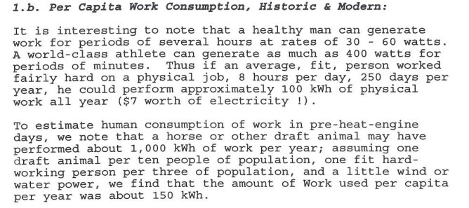
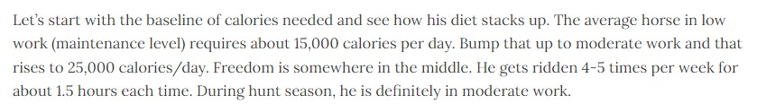
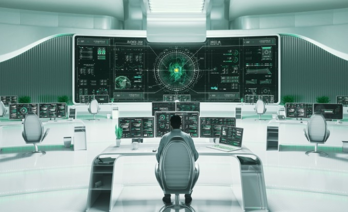
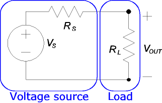

# Verimlilik, Hipotez ve İnsan-Makine İlişkisi

Bazı kavramlar ilk öğrenildiğinde fazla temiz görünür. Tanım kısa, örnek basit, sınavda sorulsa cevaplanabilir gibi durur. Ama gerçek sistemlere bakarken o kavramlar o kadar rahat durmuyor.

Etkililik, etkinlik ve verimlilik de benim için biraz böyle başladı.

İlk okuduğumda ayrım basitti:

| Kavram | Kısa anlamı |
|---|---|
| Etkililik | Doğru işi yapmak |
| Etkinlik | İşi doğru yapmak |
| Verimlilik | Çıktının girdiye oranı |

Verimliliği en yalın haliyle şöyle yazabiliyoruz:

$$
\text{Verimlilik} = \frac{\text{çıktı}}{\text{girdi}}
$$

Bu tanımlar tek başına yanlış değil. Hatta fazla doğru oldukları için insanı yanıltabilirler. Çünkü "doğru işi yapmak" dediğimizde hangi doğru? "İşi doğru yapmak" dediğimizde hangi koşulda doğru? "Çıktı/girdi" dediğimizde hangi çıktı, hangi girdi?

Benim için bu kavramlar, tanım olarak değil, küçük bir probleme uygulanınca canlandı. O problem de biraz tuhaf bir yerden geldi: insanın ürettiği mekanik iş ile çeki hayvanının ürettiği mekanik iş arasındaki fark.

## Kavramı Kullanmak

Staj sırasında Thermoflow ile ilgili notlarda insan gücü ve iş üretimi üzerine bazı sayılar vardı. Olimpiyat seviyesinde bir atletin kısa süreliğine yüzlerce watt güç üretebilmesi, sağlıklı bir yetişkinin daha uzun sürelerde çok daha düşük güçlerde çalışması, ortalama bir çeki hayvanının ise yılda yaklaşık 1000 kWh mekanik iş üretebilmesi gibi notlar.



*Şekil — Notebook'taki Thermoflow ekran görüntüsü. Bu görsel, düşünce deneyinin havadan kurulmadığını; insan gücü, çeki hayvanı ve kişi başına iş tüketimi gibi sayılardan başladığını gösteriyor.*

Aynı notlarda sağlıklı bir yetişkin insan için yıllık yaklaşık 100 kWh iş üretimi gibi bir değer vardı. Yani çok kaba bakarsak:

```text
İnsan:
Yaklaşık 100 kWh/yıl yararlı mekanik iş

Çeki hayvanı:
Yaklaşık 1000 kWh/yıl yararlı mekanik iş
```

İlk bakışta çeki hayvanı insanın yaklaşık 10 katı iş üretiyor gibi görünüyor. Bu bilgi tek başına şaşırtıcı değil. Zaten tarih boyunca insanın kendi kas gücü yerine hayvan, su, rüzgar, buhar, motor ve elektrik kullanmaya çalışması biraz da bununla ilgili.

Defterde burada küçük bir fiyatlama sapması da vardı. Thermoflow notunda bu yıllık 100 kWh işin 7 dolarlık elektriğe denk geldiği yazıyordu. Ben de "kitapçık eski ve ABD basımı; Türkiye'deki konut tarifesiyle düşünsem ne olur?" diye bakmıştım. O dönemki kaba hesabımla 100 kWh yaklaşık 144 TL gibi bir değere denk geliyordu. Bu hesap bugün güncel tarife iddiası olarak işe yaramaz; ama insan beden gücünün modern enerji sistemi karşısındaki ölçeğini sezmek için işe yarıyor. Bir insanın bir yıl boyunca zorlayıcı bedensel işle ürettiği iş, elektrik faturası ölçeğinde çok küçük kalabiliyor.

Ama benim aklıma gelen soru doğrudan bu değildi.

Peki, bir çeki hayvanının günlük kalori ihtiyacı da insanın 10 katı kadar mı?

Bu soru önemliydi çünkü sadece "kim daha çok iş yapıyor?" diye bakarsam etkililik tarafında kalıyorum. İş yapılmış mı, yapılmış. Ama "aynı iş üretimi için ne kadar enerji girdisi gerekiyor?" diye sormaya başlayınca verimlilik tarafına geçiyorum.

## Mini Düşünce Deneyi

İlk hipotezim şuna yakındı: İnsan aldığı enerjinin önemli bir kısmını yalnızca bedensel iş üretimine ayırmıyor. Beyin, metabolizma, günlük yaşam, bütün bunlar var. Çeki hayvanı ise tarihsel olarak bedensel iş üretmek üzere kullanılmış bir canlı. O halde çeki hayvanının iş üretimindeki verimliliği insana göre anlamlı ölçüde daha yüksek olabilir.

Özetlersem, başlangıçtaki beklentim şuydu:

```text
Eğer çeki hayvanı insanın yaklaşık 10 katı iş üretiyorsa,
ama insanın 10 katından daha az kalori alıyorsa,
o zaman iş üretimi açısından daha verimli olabilir.
```

Bunu kesin bir biyoloji iddiası olarak değil, kavramları kullanmak için küçük bir düşünce deneyi olarak kurdum. Zaten burada zayıf noktalar var: "kalori" değerleri gündelik beslenme dilinde çoğu zaman kcal anlamında kullanılıyor; hayvanın türü, yaşı, kilosu, çalışma süresi, insanın yaptığı iş tipi ve ölçülen "yararlı iş" tanımı sonucu değiştirebilir. Bunları bilmeden yapılacak hesap, en fazla kaba bir sezgi verir.

Yine de kaba hesabı yapmak istedim. Çünkü bazen bir hipotezin zayıf olduğunu anlamak için onu biraz zorlamak gerekiyor. Hiç hesaplamadan güçlüymüş gibi tutmak daha kötü.

Bu küçük deneyi staj döneminde [SANSÜR]'e de anlatmıştım; onun da ilgisini çekmişti ve birlikte kaynak bakmaya başlamıştık. O gün baktığımız bazı kaynakları bugün net hatırlamıyorum. Bu yüzden burada hesap, güçlü kaynaklı bir biyoloji iddiası değil; notebook içinde yapılmış, sonra da sınırlılığı kabul edilmiş bir düşünce alıştırması olarak kalıyor.

Kullandığım verimlilik biçimi şuydu:

$$
\eta = \frac{\text{yararlı iş}}{\text{enerji girdisi}}
$$

Notebook'ta çeki hayvanı tarafını kurarken uygun hayvanı seçmekte zorlandığımı da yazmıştım. Sığırda kilo alma, inekte süt verimi, yarış atında özel diyet gibi değişkenler vardı; eşek için de yeterli bilgi bulamamıştım. Sonunda normal bir at için, haftada birkaç gün orta düzey hareketlilik varsayan kaba bir kaynağı kullanmıştım.



*Şekil — Notebook'ta çeki hayvanı tarafındaki kalori hesabını kurarken kullandığım kaynak ekranı. Kesin veterinerlik verisi gibi değil, düşünce deneyinin kaba girdisi olarak duruyor.*

Notlarımdaki yaklaşık değerlerle; burada "kalori"yi beslenme dilindeki anlamıyla, yani kcal gibi okumak gerekiyor:

```text
İnsan için günlük kalori ihtiyacı:
2590 kcal/gün

Çeki hayvanı için günlük kalori ihtiyacı:
25000 kcal/gün
```

Buradan yıllık enerji girdisine ve yıllık iş çıktısına bakınca notumda şu yaklaşık sonuçlara ulaşmıştım:

$$
\eta_{\text{insan}} \approx 0.107 \ \text{Wh/kcal}
$$

$$
\eta_{\text{at}} \approx 0.109 \ \text{Wh/kcal}
$$

Kaynak notumda bu fark yaklaşık yüzde 1,8 olarak işaretlenmişti. Sayının kendisinden daha önemli olan şey şu: fark beklediğim kadar büyük çıkmadı.

Bu sonuç ilk bakışta hipotezimi doğrular gibi durabilir. Çünkü çeki hayvanı tarafında verim biraz daha yüksek görünüyor. Ama verimliliklerin birbirine bu kadar yakın çıkması, benim için tam tersine uyarıydı. Buradan "hipotezim doğru çıktı" diye sert bir sonuç çıkarmak yanlış olurdu.

Hatta daha açık söyleyeyim: yaptığım hesaplamalar veya yöntemsel yaklaşım tamamen yanlış da olabilir. Bir doktor, bir veteriner hekim ya da bu alanda çalışan bir mühendis bu küçük hesabın bir yerinde ciddi hata olduğunu söyleyebilir. Bu ihtimali saklamak istemem.

Ama bu küçük çalışma yine de boşa gitmiş gibi gelmiyor. Çünkü burada amaç insan ile çeki hayvanının verimliliğini bilimsel olarak kesin sınıflandırmak değildi. Amaç, bir kavramı ezberden çıkarıp küçük bir probleme uygulamaktı. Sonuç güçlü çıkmayınca da hipotezde ısrar etmemekti.

Verimlilik kavramı bende bu noktada biraz daha gerçek hale geldi. Tanımı bilmek yetmiyor. Hangi girdiyi seçtiğini, hangi çıktıyı ölçtüğünü, hesabın hangi varsayıma yaslandığını ve sonucun ne kadar kırılgan olduğunu da görmek gerekiyor.

## Bedensel İşten Bilişsel Role

İnsan ve çeki hayvanı kıyası, enerji sistemleri açısından başka bir yere de açılıyor. İnsan bedensel güç kaynağı olarak makinelerle yarışamaz. Zaten modern enerji sistemlerinin varlığı biraz da bu yüzden anlamlı. Bir türbinin, jeneratörün veya motorun yanında insanın kas gücü neredeyse yok hükmünde kalıyor.

Ama buradan "öyleyse insanın rolü azaldıkça sistem daha iyi olur" sonucuna doğrudan gitmek bana fazla aceleci geliyor.

Çünkü enerji sistemlerinde insanın rolü yalnızca mekanik iş üretmek değil. İnsan bazen ölçer, izler, yorumlar, karar verir, öncelik kurar, normal ile anormal arasındaki farkı ayırt eder. Bu rolün de hataya açık olması, rolün önemsiz olduğu anlamına gelmiyor.

T3000 kontrol sistemiyle ilgili kısım bende bu yüzden kaldı.

Staj notlarımda T3000, güç santrali kontrol sistemi olarak geçiyordu. Modern bir santralde kontrol sistemi çok fazla şeyi izliyor, düzenliyor ve operatörün önüne anlamlı hale getiriyor. Bu tür sistemlerde insan müdahalesi eskiye göre azalmış olabilir. Hatta notlarımda, planlanmamış yavaşlama veya kesintilerin `%42` gibi kayda değer bir kısmının insan hatası kaynaklı olduğuna dair bir oran vardı. Bu oranı bu turda güç santrali özelinde yeterince netleştiremediğim için burada kesin sayı gibi kullanmıyorum; ama o gün bende şu soruyu başlattığı için notebook izini siliyor da değilim.

Böyle bir bilgi duyunca kolay bir sonuç var: İnsan hata yapıyor, o halde insanı sistemden ne kadar çıkarırsak o kadar iyi.

Ama ben o sonuca hemen gitmek istemedim. Önce şunu sordum:

- Operatörün yaptığı iş için gereken bilişsel beceri düzeyi nedir?
- Operatörün tecrübesi ne kadar önemlidir?
- Görevin karmaşıklık seviyesi nedir?

Bu soruların arkasında şu şüphe vardı: Eğer kontrol sistemi çok gelişmişse ve birçok işlem otomatikleşmişse, operatörün işi dışarıdan bakınca basit görünebilir. Fakat basit görünmesi, gerçekten basit olduğu anlamına gelmeyebilir.



*Şekil 1. T3000 bağlamında kontrol odası görüntüsü. Bu görsel iddiayı kanıtlamak için değil; operatörün soyut bir "kullanıcı" değil, gerçek bir operasyon ortamının parçası olduğunu hatırlatmak için burada. Kaynak durumu: kısmen net.*

Bana verilen cevap da bu yöndeydi: operatörün önemli ve zor bir işi var.

Bu cevap, insanı kutsamak anlamına gelmiyor. "Makine ne yaparsa yapsın, asıl insan bilir" gibi bir yere gitmek istemem. Aynı şekilde makineyi kutsayıp "insan sadece hata kaynağıdır" demek de eksik olur.

Bana daha doğru gelen okuma şu: T3000 gibi bir sistem, hız, ölçüm, izleme ve kontrol tarafında insanın tek başına taşıyamayacağı bir yükü taşıyor. Operatör ise her şeyi eliyle yapan kişi olmaktan çok, sistemin durumunu anlayan, kritik anda karar veren ve otomasyonun ne yaptığını yorumlayan kişi haline geliyor.

Burada insan-makine ilişkisi bir yer değiştirme meselesi değil. Daha çok iş bölümüne benziyor. Makine sürekli ölçüyor, hızlı tepki veriyor, karmaşık akışı düzenliyor. İnsan ise özellikle beklenmeyen durumlarda bağlam kuruyor. Hata riski de burada bitmiyor; hatta bazen tam bu bağlam kurma anında ortaya çıkıyor. Ama bu, insanı sistemden düşünmeden çıkarmak için yeterli bir gerekçe değil.

Azami etkililik ve etkinlik, tek başına zeki operatörde ya da tek başına iyi yazılımda değil; ikisinin birlikte doğru çalışmasında olabilir.

Bu cümlede özellikle "olabilir" diyorum. Çünkü kontrol sistemleri konusunda kesin hüküm verecek kadar uzman değilim. Ama stajda bende kalan sezgi bu: insanın rolü azaldıkça değil, insanın rolü doğru tanımlandıkça sistem daha iyi çalışıyor.

## Jeneratör, Yük ve Eksik Model

Bu yazının son parçası, bende şaşırma hissi bırakan bir soru-cevap anı.

[SANSÜR] bana jeneratör milinin dönme hızını sormuştu. Cevabı doğrudan bilmiyordum. Şebeke elektriğinin 50 Hz frekansta olduğunu biliyordum; buradan yola çıkarak, o bağlamdaki iki kutuplu senkron jeneratör varsayımı için saniyede 50 kez dönüyor olabilir diye cevap verdim. Bu cevap doğru kabul edildi. Bunu genel bir jeneratör kuralı gibi değil, o anki bağlamda kurulmuş kısa bir akıl yürütme gibi okumak daha doğru.

Sonra asıl soru geldi: Peki bu mil bu kadar kolay dönebiliyorsa, neden bu kadar çok yakıt yakılıyor?

Bu soru beni durdurdu. Çünkü zihnimde jeneratör mili neredeyse boşta dönen bir mil gibi duruyordu. Döndürüyorsun, dönüyor; elektrik de çıkıyor gibi. Bu çok eksik bir modeldi.

Bana verilen açıklama Lorentz yasası üzerinden geldi. Tüketiciler devreye yük olarak bağlandığında, sistem yalnızca "elektrik alan tarafında" kalmıyor. Akım, manyetik alan ve hareket birbirine bağlanıyor. Yük arttıkça jeneratör tarafında mile karşı koyan elektromanyetik etki de artıyor. Yani tüketici sadece elektriği alan pasif bir uç değil; jeneratörün mekanik tarafında karşı tork olarak hissedilen bir talep oluşturuyor.

Basitçe:

$$
P = \tau \cdot \omega
$$

Burada \(P\) güç, \(\tau\) tork, \(\omega\) ise açısal hız. Şebeke frekansını korumak için hız sabit tutulmak zorundaysa, daha fazla güç talebi daha fazla tork ihtiyacı demektir. O torku sağlamak için de türbin tarafında daha fazla mekanik enerji gerekir.

Lorentz kuvveti de bu sezginin elektromanyetik tarafını hatırlatıyor:

$$
\vec{F} = q(\vec{E} + \vec{v} \times \vec{B})
$$

Bu formülü burada çözmeye çalışmıyorum. Benim için asıl öğrenme noktası şuydu: elektriksel yük, mekanik dünyada görünmez bir direnç gibi davranabiliyor. Jeneratör milinin "kolay dönmesi" ile santralin "kolay güç üretmesi" aynı şey değil.



*Şekil 2. Yük bağlı devre fikrini basitçe düşünmek için kullandığım görsel. Jeneratörün fiziksel olarak tam modeli değil; sadece yük kavramını akılda tutmak için bir ara görsel. Kaynak durumu: kısmen net.*

Bu şaşırma anı T3000 kısmına da bağlanıyor. Çünkü santralde yük değişimleri teorik bir ayrıntı değil. Evlerde bir cihazın açılıp kapanması küçük görünebilir; ama sistem ölçeğinde yük sürekli değişiyor. Bu değişimi yakıt, türbin, jeneratör, frekans, koruma sistemleri ve kontrol yazılımı birlikte karşılıyor.

Notebook'ta [SANSÜR]'ün aktardığı bir kaza örneği de vardı: yük değişimleri ve kontrol gerekliliği anlatılırken Afşin Termik Santrali'nde yaşandığı söylenen, devasa makine parçalarının yerinden fırladığı bir olaydan bahsedilmişti. Bu ayrıntıyı burada doğrulanmış kaza raporu gibi kullanmıyorum. Ama o gün bende yarattığı etki önemliydi: yük değişimi sadece ekranda oynayan bir sayı değil, yanlış yönetilirse mekanik dünyada çok sert sonuçları olabilen bir şey.

O yüzden kontrol sistemi sadece ekranda değer gösteren bir arayüz gibi düşünülmemeli. Yük değiştiğinde makinenin ne yaşadığını, nerede sınır değerlerine yaklaştığını, ne zaman müdahale gerektiğini ve ne zaman durmanın çalışmaktan daha doğru olduğunu takip eden bir katman gibi düşünmek gerekiyor.

Benim burada öğrendiğim şey yalnızca Lorentz yasası değildi. Daha doğrusu, Lorentz yasasının adı tek başına öğrenme anını anlatmıyor. Öğrenme anı, kafamdaki modelin eksik olduğunu fark ettiğim andı.

Önce "50 Hz ise mil şu hızda dönüyor" diye bir cevap verdim. Bu cevap belli bir parçada doğruydu. Ama sonra aynı model, "neden yakıt gerekiyor?" sorusunu açıklayamadı. Model orada yetersiz kaldı. Yeni açıklama gelince, jeneratörü boşta dönen bir nesne gibi değil, yükle birlikte davranan bir enerji dönüşüm sistemi olarak düşünmeye başladım.

Bu üç parça benim için aynı yere bağlanıyor: kavram öğrenmek, küçük bir hipotez kurup sonucu zorlamamak, sonra insan-makine ve jeneratör-yük ilişkisine bakmak. Enerji sistemlerinde doğru cevap kadar, hangi modeli kurduğun ve o modelin nerede kırıldığını fark edip etmediğin de önemli. Staj defterinden bu repo'ya taşımaya değer bulduğum şey biraz da bu: bilgiyi olduğu gibi saklamak değil, onun kafamda hangi soruya dönüştüğünü göstermek.
